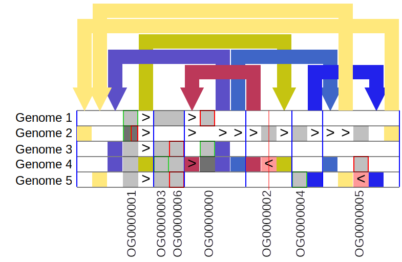
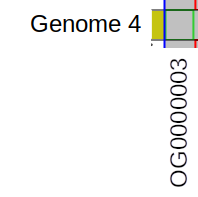
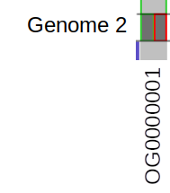
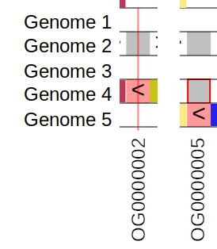
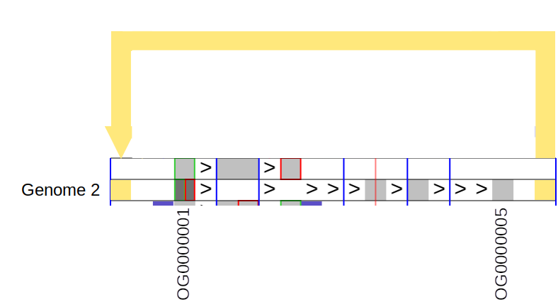

# User manual for Pantograph Visualisation tool

## Introduction

This manual describe how to use all the controls and how to read the matrix view of the graph visualisation. It will cover two types of graphs: nucleotide and gene graphs.

Nucleotide graph is a graph, where each node contains certain sequence. Gene graph does not have any sequences. In it each node represent certain type of object, e.g. gene, block of genes, exon, or anything else. Normally, paths in such genes are build based on in what sequence genes are going on actual genome (by genomic positions). More details below.

## How to read matrix view

### How nucleotide graph is formed

Initially, we have several sequences/genomes, which (we assume) have some similarity. Then we identify identical subsequences repeated over accessions and within one accession. Private sequences are just sequences repeated only once. Of course, there is a compromise between going to a single nucleotide (only 4 possible letters) or to the whole sequence (each sequence is a private sequence). There should be some balance between the two extremes. Usually, it is done via using k-mers with reasonably large k. You can see these identified subsequences split in the image:

| - | - |
|---|---|
| Each unique subsequence becomes a graph node. |  |
| Sequence of these subsequences in each genome define graph paths |  |

Graph edges/links are determined from graph paths.

The symbols ‘+’ and ‘-‘ in paths are used to indicate whether a node/gene instance is found in the 
orientation that the node/gene is most commonly found in this chromosome (not whether it is 
on the +ve or -ve strand). ‘+’ nodes/genes are normal, ‘-’ nodes/genes are inverted.

This graph will look like the following in Pantograph visualisation tool:

### How gene graph is formed

Annotated genes for specific accession (and specific chromosome/sequence) are placed 
in the order of their 5’ position (in accession specific coordinate system). That way, a sequence of genes for each accession is obtained.

Genes are defined by some universal concept, that can be identified in multiple accessions and 
in several locations in a single accession, e.g., orthogroups, or some other metric that identifies
similarity between genes instances (or wider, annotated intervals).

As an example, I created an artificial short sequence of genes for 5 accessions/genomes to 
show a lot of different types of rearrangements yet to be able to follow each sequence from 
start to end. The sequence of genes are as follows.

As we can see, we have 25 gene instances grouped under 7 conceptual labels.

Each unique similarity ID becomes a node in a graph. And to define paths in Genome Graph
node numbers (1-based) are used instead of similarity IDs in the same sequence.

The symbols ‘+’ and ‘-‘ are used to indicate whether a node/gene instance is found in the 
orientation that the node/gene is most commonly found in this chromosome (not whether it is 
on the +ve or -ve strand). ‘+’ nodes/genes are normal, ‘-’ nodes/genes are inverted.

Please note, that node numbers are not random IDs, but define unified linearised graph 
coordinate system calculated to maximise the conservation of linear node/gene order 
across all accessions.

| - | - |
|---|---|
|  |  |

Using given nodes order and given paths, we can visualise this graph.

You can try to follow each of the accession (each row) and see how the original sequence of
genes (previous page) is recovered. If it is still not clear, the following section will present the
Legend, possibly, not exhastive, but enough to understand the main principles.

### Reading the visualisation

All explanation is using gene graph as examples, but the same applies to nucleotide graphs.

#### Start and end of paths/sequences

| - | - |
|---|---|
|  | Cell with green border: In this case, green border means that the given accession starts from one of the OG0000003 genes represented by this cell.  On higher zoom levels (not available), single cell can represent multiple genes. In this case, green border means that the given accession starts from one of the genes represented by this cell. |
|  | Cell with red border: Genome 2 and 4 sequences ends with gene OG0000006.  On higher zoom levels (not available), single cell can represent multiple genes. In this case, red border means that the given accession ends by one of the genes represented by this cell.  Please note, that if an accession ends by inverted gene/node, the border will be Yellow, not red (because the inverted nodes are presented by red cells). |
|  | In rare cases, an accession can start and end at the same gene (node). In this case, half of the cell will be enclosed in green border, and another half in red border. Obviously, it can happen only if the gene is repeated at least twice, which is clearly visible as darker grey colour in comparison to surrounding cells.   It can happen much more often on higher zoom levels, because this notation Will mean that given sequence starts and end by genes/nodes represented by this cell. |

#### Continuity arrows

| - | - |
|---|---|
|  | Continuity arrows: This notation means that in accession Genome 2 gene OG0000002 is preceding (upstream) gene OG0000004, which precedes gene OG0000005. At the same time these genes are in the same sequence in linearised graph order (which tries to preserve consensus.   Continuity arrow between two consecutive genes appear only If in some accessions there is non-continuous (coloured) arrow. |
|  | Continuity without arrow: If in no accessions there is any arrows (indicating non-linear rearrangement) appear at the right end of left gene (OG0000003) or left end of the right gene (OG0000006) then continuity arrow will not appear and the cells will appear as a block.  Please note, that any cell (node) has a start (to where arrows will come) and an end (from where arrows will go). For normal cells they are left and right respectively. An inverted cell comprises all or part of an inverted segment; in the latter case, continuity arrows are shown right to left (e.g., where 1 2 3 4 5 has been rearranged by inversion to 1 4 3 2 5). |
|  | Deletions (cells absent from a particular individual) are indicated by white cells. Continuity should be followed through such delitions. This notation means that accession “Genome 2” does not have genes OG0000000, OG0000003 and OG0000006, and that OG00000001 is directly upstream (precedes) OG0000002. |

#### Repeats

| - | - |
|---|---|
|  | Number of copies of a given gene (node) in the visualised graph* is shown by the colour of each cell.  The colours for each number of copies are always available on the legend. Colour can be turned off and all cells will be light gray/red.   In this image   - in Genomes 1 and 3 all four shown genes have one copy,  - in Genome 2 only OG0000001 has two copies, and other three genes are not present, - in Genome 4 all four genes present with one copy except OG0000000 which has 2 copies, - in Genome 5 genes OG0000001, OG0000003 and OG0000006 are present (one copy) and OG0000000 is missing.|
|  | Number of repeats is repflected by the colour of specific cell. You can see colour legend in the bottom left corner. |

\* Note that if graph is created for a single chromosome, then all copy numbers, as well as any other metrics (e.g. fraction of inverted copies/nodes) and analyses are calculated ONLY over this chromosome. It works fine for alignment, but for SV calling and other types of analysis, it will skew the results. Further work is needed to create a graph for multiple chromosomes (molecules).

#### Inversions

| - | - |
|---|---|
|  | In this case, (pale) red cell indicate that gene OG0000002 in Genome 4 and gene OG0000005 in Genome 5 are inverted compared to their normal orientation.  To understand it a bit better, let’s look at the example again.  - Gene OG0000002 is shown as inverted in Genome 4 and in normal direction in Genome 2. That means that either the gene in Genome 2 on Forward and in Genome 4 on reverse, or vice versa. - Gene OG0000005 is inverted in Genome 5 and in normal direction in Genomes 2 and 4. That means that the gene is on forward strand in Genomes 2 and 4 and on reverse in Genome 5, or vice versa.|

Please, note that continuity arrow between two inverted cells will be in other direction. That is because normal cell has arrows coming to the left and going out from the right edge. Inverted cell has arrows coming in from the right edge and going out from left edge.

Please, also note that if a gene in particular accession has more than one copy, it will be shown as inverted only if more than 50% of its copies are inverted (on minority strand for this Gene in pangenome).

At higher zoom levels, both copy numbers and inversion fractions are calculated as average for all genes represented by the given cell.

That notation can be confused with continuity arrow between two inverted cells. Continuity Arrows will always be shown either on white background or coloured background beneith the start or end of an arrow. In this case it is on pale red background without arrow on top.

#### Arrows and links

This example shows basic arrow in a single accession. This particular arrow tells us that gene OG0000005 precedes (directly upstream) the second copy of gene OG0000001, which is also the last gene of the sequence. The first copy of OG0000001 is the first gene of the accession as well. 

Basic arrow showing some rearrangement by which we understand the difference of accession gene sequence from linearised graph nodes sequence/order. In most cases, it indicates genuine non-linear variation in pangenome, but in some cases it can be an artefact of visualisation due to graph linearisation cannot be perfect (due to the fact that non-linear structure is shown in linear manner).

| - | - |
|---|---|
|  | Basic arrow showing some rearrangement by which we understand the difference of accession gene sequence from linearised graph nodes sequence/order. In most cases, it indicates genuine non-linear variation in pangenome, but in some cases it can be an artefact of visualisation due to graph linearisation cannot be perfect (due to the fact that non-linear structure is shown in linear manner).  For example, the purple arrow indicate that in both Genomes 3 and 4, gene OG0000001 follows (directly downstream) OG0000000. |
|  | In some cases, arrow indicator can also have a continuity arrow. This means that the cell to which both arrows relate, has more than 1 copy and one copy is following (in genome gene sequence) previous (in linearised graph node order) gene and another copy has predecessor defined by the arrow.  It is probably easier to understand using the example: Here gene OG0000000 has incoming red arrow with continuity arrow. Continuity arrow tells us that one copy of OG0000000 follows (directly downstream) OG0000006, another copy of OG0000000 follows (inverted) gene OG0000002. |

### Cell details

The user can get more information about each cell in the matrix (grey, or red if inverted squares). If a mouse is placed over the cell of interest, a tooltip appear like the following:

It provides basic info like name of the accession, marking whether it is start or end (or none) of the sequence/path. In addition it provides information about copy number (how many times this node appear in this accession) and inversion ratio.

It is worth noting here that copy number is averaged over all nodes represented by the cell. On the lowest (most detailed zoom level) one cell represent either one nucleotide (nucleotide graph) or one gene (gene graph) and its copy number is actual (subject to the note in [section above](#Repeats)). But on higher level zoom (less detailed), one cell can comtain multiple nucleotides, or genes, or even nodes. In this case, the average copy number will be taken over all nucleotides/genes represented by this cell.

Inversion ratio is averaged over all copies of all nucleotides/genes represented by the given cell.

In addition, column number tells which column of the matrix at the given zoom level this cell occupies. It is counted from the very first nucleotide/gene of the first node and numbered throughout the whole graph. It is the column number that the user set when chooses the central position (see [section Position Control](#position-control), the edges and last bin are also given in terms of columns (see [section Information fields](#information-fields)).

Finally, Path position is which position number this nucleotide occupies in the path. For nucleotide graphs it will be the same as genomic position, but for gene graph, it will just tell you the number of gene as it "appear" in the genome.

If the user would like to get even more information (given it is available, of course), they can right click on the cell and get special floating block with the information available in tooltip (but with extra explanation what each value means) and also, if any metadata (like annotations, genomic or pangenomic (Multiple Sequence Alignment) position  is available, it will be pulled from special Redis DB through API and shown here.

As an example, here is one of the block

The cell that was clicked is highlighted with green (see where red arrow points at).

To close this floating block either left click outside it or press Esc button on the keyboard.

## User controls

Pantograph visualisation tool has a control panel that gives a lot of control to the user. THe panel looks like this:

and allows to change project and case, control zoom and position, search via genes and positions, filter accessions and control what is shown and the size of the main matrix.

### Choosing project and case

Every time the user use pyGenGraph to export a visualisation project, it adds information about this project to data index file. Pantograph visualisation tool reads this data index and from it knows about all available projects. Then it looks at each project data index and knows what cases (e.g. different chromosomes) are available. So, the user can switch between projects (using drop down list (1) in the figure) and between cases for a given project (using drop down list (2) in the figure), see the screenshot:

Please note that if only one case is available then drop down list is inactive.

### Zoom control

User can control which zoom level to show. Zoom levels have numbers, the higher the number the less detailed (and more nodes/nucleotides in the view). This number means what is the maximum number nucleotides (or genes in case of gene graph) can be represented by a single cell.

Zoom can be controlled either by drop down list of all available zoom levels or by clicking on "+" (get to next , more detailed zoom level, zoom in) and "-" (get to next, less detailed zoom level, zoom out). See controls highlighted by red rectangle on the screenshot below. 

And here is an example of gene graph shown above (at the beginning of the manual) on zoom level 8 (see image below). As you can see all arrows disappear and all nodes combined together to give an overview of the accessions.

Please note, that zooming is not working as expected at the moment and it is still being developed.

### Position control

The user can scroll the matrix left and right only using position controls available. Position in this case is represented as a number. This number is a consequtive matrix column number which should be placed at the central position (vertical red line in the centre of the main view).

It can be done via either setting explicitly position (using text field in the highlighted block in the following image) or using buttons `<` and `>` to jump left or right half of the distance (or buttons `<<` and `>>` to jump left or right full distance) between the centre and left and right visible edge of the view respectively.

The other option to control position is to use navigation bar at the bottom of the control panel (highlighted with red rectangle in the image below). The whole length of the navigation bar represent the whole length of the linearised graph at the selected zoom level (light blue actually goes from left edge to right edge).

Yellow/orange block represent visible part of linearised graph. If the user place a mouse pointer anywhere on the navigation bar, tooltip will tell you the column (bin) number which this particular point corresponds to (see green rectangle highlighting it in the image below). If the user clicks on this point with left mouse button, then the tool will place this particular column in the centre of the view.

Another way to change position is to click on arrows or coloured squares in arrow columns. It will jump to the other side of the arrow and place it in the centre of the view.

### Component selection

The user can also select specific components by just clicking on it. It becomes highlighted with blue background and red boundaries. It is very useful because the selection is sustained through moving up and down zoom levels and scrolling horizontally.

When there is a selected component and the user moves zoom out, a component that contains the nucleotide/genes of the selected components will be highlighted as well. If no deselection/selection happened, then if the user zoom down, the same original component will be highlighted/selected.

On the other hand if the user goes zoom in, and the selected component contained several components in the more detailed zoom level, all of them will be highlighted. The user can deselect one of them, but if goes zoom out again, the same component will still be highlighted, but this selection on the lower (more detailed) zoom level will be sustained.

In the figure below, a selected component (highlighted by red rectangle) is visible.

### Searching genes/positions

If Redis DB and special Pantograph API is available and necessary metadata was passed to this DB, the user can search specific annotations or positions. This is done using control highlighted by red rectangle on the following image.

There are three options:

- Can be searched by annotation names (e.g. gene names). For this, annotations should be available in the graph and exported to the available redis DB. For this, option `Gene name` in the drop down list highlighted by green rectangle in the figure below.
- Can be searched by path positions (select `Path position` in the drop down list). See more details of what is path position in [section Cell details](#cell-details). It is effectively genomic position for nucleotide graphs and consequtive number of gene in the path for gene graph.
- Search by genomic position (select `Genomic position`). That requires that genomic positions for each cell/node is available in the graph metadata and passed to the Redis DB. It is not that relevant to nucleotide graphs, but very relevant to gene graphs.

### Filtering accessions

You can filter what rearrangements you would like to see and which not.

To do this, you need to use Filter rearrangements block highlighted in red rectangle in the image below:

This can be done in two ways:

- All-vs-all way: The user should use the first drop down list to select 2 or more accessions for this to work. This means that if any arrow representing rearrangement appears in all or none of the selected accessions, they get dimmed, all others will be shown as bright (active). Also, only selected accessions are highlighted, the rest are dimmed.

If only two accessions is selected, then it is equivalent to one-vs-one comparison.

In the figure below, a case of all-vs-all filtering is represented when accesions 1, 3 and 4 (the top most row is accession 1) is selected.

- One-vs-all way: For this first the user need to select all accession involved in the first drop down list. After than one accession (main accession) should be selected to be "one" in one-vs-all. In this case any rearrangements will be dimmed if both main accession and at least one of the rest of the group either has or does not have this rearrangement. Otherwise if main accession has a rearrangement and all others do not or if any of the other ones have it and the main one does not have it, then it is highlighted and shown in bright colour. 

An example with three accession (1, 3, and 4) selected, and accession 3 is chosen as main, shown in the figure below.

### Various view control

#### Hiding basic inversion links

If there is an continuous inversion block of cells in a graph, it will be shown with two arrows, which does not bring a lot of information because inversion is already highlighted by the colour of the cell. This can be hidden and substituted with artificial continuity arrows by turning on the switch "Hide inversion links" highlighted in the screenshot below:

It will also hide pairs of arrow describing short normal sequence of cells inside longer inversion block.

If the inversion is involved in more complex rearrangements, then no arrows will be hidden.

This option is turned on by default.

#### Highlighting accessions using mouse

By default when the mouse pointer is over an accession,  only tooltip is shown. If the switch "Highlight accessions"  (highlighted with number 1 on the figure below) is switched on, then when the mouse if over cells or link columns of specific accession, then all other accessions are dimmed. Also all arrows not presented in the current accession also gets dimmed.

The switch "Dimmed by default" (highlighted with number 2 in the screenshot below) controls whether all accessions should be bright (off) or dimmed (on) when mouse if off all accessions.

Here (image below) is an example of dimmed all accession except accession "genome 5" on which the mouse pointer is placed.

#### Copy number colouring control

In some cases, copy number colouring (darker colours for more copies of specific node/cell) is not needed and only adds to a clutter. In this case, it can be turned off by switching off "Show copies" switch (highlighted in the screenshot below).

It is strongly recommended to turn off copy number showing if you do any accession dimming (filtering or highlighting accession described above). At the moment, when cells with more than 1 copy is dimmed it looks like normal cell in not dimmed accession and it is confusing. It will be automated eventually, but at the moment, it is recommended to turn this option on.

Here (in the screenshot below) is how the gene graph from the beginning of the manual looks like with this option turned on.

### Cell/matrix size control

The size of the cells can be controled as well. The controls "Row Height" and "Column Width" (see highlighted controls in the figure below) control height and width of cells respectively. Please note, that changing the row (or cell) height does not change how many cells can be shown and does not change the visible columns (and thus does not require re-rendering). Change of the column/cell width width on the other hand requires rerendering because different number of cells can be fit on the screen.

### Clearing cache

If some data was changed, and the user reloaded the browser, but it does not show correctly, it can be due to stuck cache. Just try to press "Clear cache" button (highlighted in the screenshot below). It may help.

### Information fields

Finally, there are a few read-only fields that give some extra information about the graph or specific position.

First, there are two text fields "Left edge bin" (marhed with number 1 in the screenshot below) and "Right edge bin" (marhed with number 2 in the screenshot below). They shows the left most and right most (respectively) column numbers that are visible in the view.

The label "Pangenome Last Bin" (marked with number 3) effectively provides total number of columns on the selected zoom level of the loaded graph.

The label "Num. of individuals" (marked with number 4) provides a number of accessions/paths (number of rows) in the graph.

